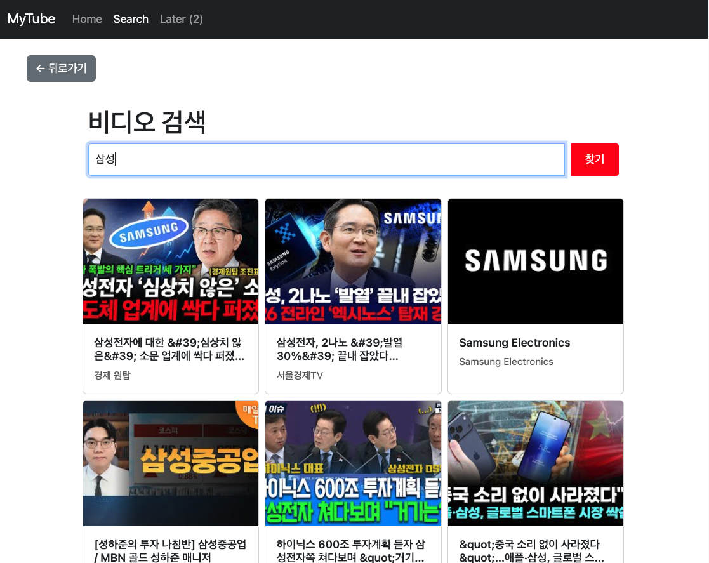
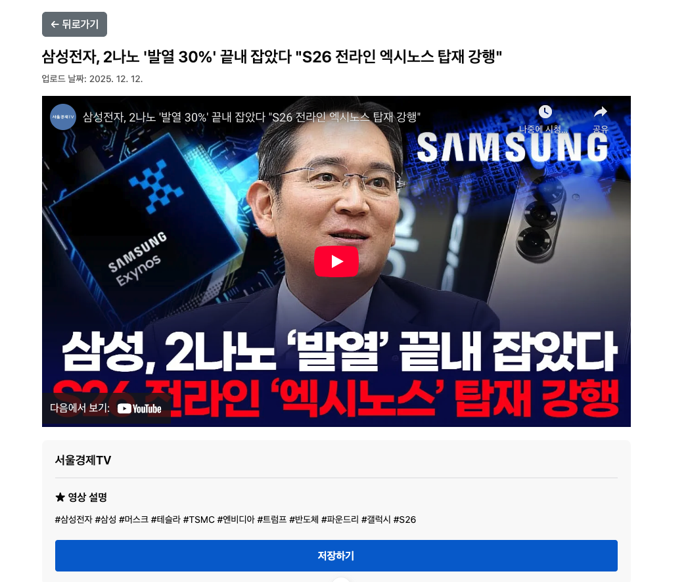
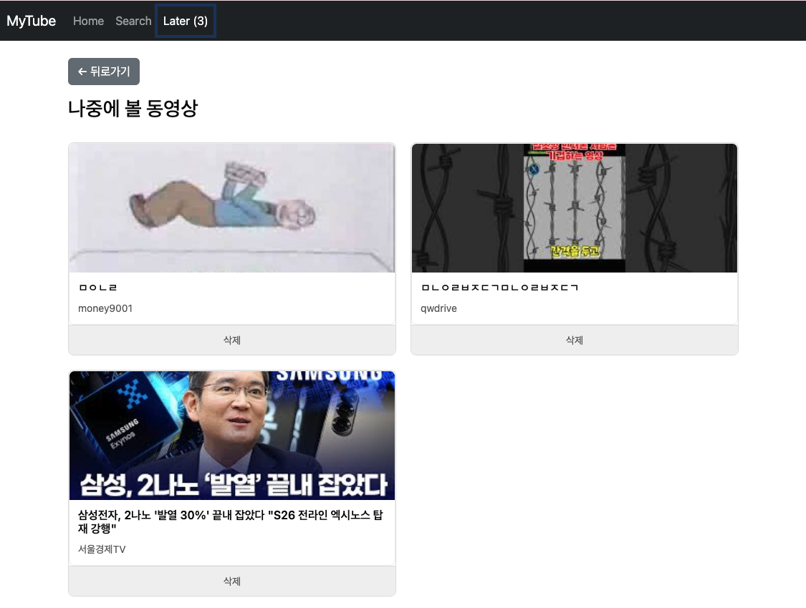

# 🎬 11-PJT: YouTube 영상 검색 서비스

## 📌 프로젝트 개요

이 프로젝트는 **YouTube Data API v3**를 활용하여 관심 주제 관련 동영상을 검색하고, 시청 및 저장할 수 있는 서비스를 구현한 **Vue.js 기반 SPA(Single Page Application)** 입니다. 사용자가 키워드를 입력하면 해당 주제와 관련된 영상을 검색하여 목록으로 출력하고, 영상을 클릭하면 상세 페이지에서 재생할 수 있습니다. 또한 Local Storage를 활용하여 나중에 볼 영상을 저장하고 관리할 수 있는 기능을 제공합니다.

---

## 🛠 개발 환경

- **Language & Framework**: JavaScript, Vue.js 3
- **Styling**: Bootstrap 5
- **API**: YouTube Data API v3
- **State Management**: Pinia
- **HTTP Client**: Axios
- **Build Tool**: Vite
- **IDE**: Visual Studio Code

---

## 👥 팀원

- 김현아: 프로젝트 설계, 컴포넌트 개발, API 연동, UI/UX 구현
- 강민규: 프로젝트 설계, 컴포넌트 개발, API 연동, UI/UX 구현

---

## 📋 작업 순서

1. **요구사항 분석 및 API Key 발급**
2. **프로젝트 초기 설정 (Vue Router, Pinia, Bootstrap 설치)**
3. **컴포넌트 구조 설계**
   - NavBar, VideoCard, SearchView, VideoDetailView, LaterView
4. **기능 구현**
   - F01: 동영상 검색 결과 출력
   - F02: 동영상 상세 정보 출력
   - F03: 나중에 볼 영상 저장 및 삭제
5. **코드 정리 및 GitLab 업로드**

---

## ✅ 구현 기능 (필수 과제)

### 🔹 F01 - 동영상 검색 결과 출력

- 네비게이션 바의 "Search" 메뉴를 통해 검색 페이지 접근
- 검색창에 키워드 입력 후 Enter 또는 버튼 클릭 시 YouTube API 호출
- `https://www.googleapis.com/youtube/v3/search` 엔드포인트 활용
- 검색 결과에서 썸네일, 제목, 채널명 추출하여 카드 형태로 출력
- 각 영상 카드는 `VideoCard.vue` 컴포넌트로 구성
- 카드 클릭 시 상세 페이지(`/video/:videoId`)로 이동
- Bootstrap Grid 시스템을 활용한 반응형 레이아웃 (모바일 1개, 태블릿 2개, 데스크탑 3개)

---

### 🔹 F02 - 동영상 상세 정보 출력

- 검색 결과에서 특정 영상 클릭 시 상세 페이지로 이동
- `route.params.videoId`를 활용하여 비디오 ID 추출
- YouTube API의 `videos` 엔드포인트를 사용하여 상세 정보 조회
- iframe 태그를 이용한 영상 재생 기능
- 영상 제목(title), 채널명(channelTitle), 설명(description) 표시
- "나중에 보기" 저장 버튼 제공
- 뒤로가기 버튼을 통한 이전 페이지 이동

---

### 🔹 F03 - 나중에 볼 동영상 저장 및 삭제

- Local Storage를 활용한 "나중에 볼 영상" 기능
- 상세 페이지에서 "나중에 보기" 버튼 클릭 시 영상 정보 저장
  - 저장 정보: videoId, title, channelTitle, thumbnailUrl
- 이미 저장된 영상의 경우 "저장 취소" 버튼으로 변경
- `/later` 페이지에서 저장된 영상 목록 출력
- 각 항목 옆 "삭제" 버튼을 통한 개별 삭제 기능
- 저장된 영상이 없을 경우 "등록된 비디오 없음" 안내 문구 표시
- Pinia Store를 활용한 상태 관리

---

## 📂 프로젝트 구조

```
11_pjt/
├── src/
│   ├── components/
│   │   ├── NavBar.vue          # 네비게이션 바
│   │   ├── NavbarItem.vue      # 네비게이션 메뉴 아이템
│   │   ├── VideoCard.vue       # 영상 카드 컴포넌트
│   │   └── GoBack.vue          # 뒤로가기 버튼
│   ├── views/
│   │   ├── HomeView.vue        # 홈 페이지
│   │   ├── SearchView.vue      # 검색 페이지
│   │   ├── VideoDetailView.vue # 영상 상세 페이지
│   │   └── LaterView.vue       # 나중에 보기 페이지
│   ├── stores/
│   │   └── video.js            # Pinia 스토어 (영상 저장 관리)
│   ├── router/
│   │   └── index.js            # Vue Router 설정
│   ├── App.vue                 # 메인 앱 컴포넌트
│   └── main.js                 # 앱 진입점
├── .gitignore
├── package.json
└── README.md
```

---

## 🔑 주요 기술 및 구현 내용

### 1. **YouTube API 연동**

- Axios를 활용한 비동기 API 호출
- 검색 API(`search`)와 상세 정보 API(`videos`) 활용
- API Key 관리 및 쿼리 파라미터 구성

### 2. **Vue Router**

- 동적 라우팅을 통한 영상 상세 페이지 구현
- `route.params`를 활용한 videoId 전달
- `router.back()`을 통한 뒤로가기 기능

### 3. **Pinia 상태 관리**

- Local Storage와 연동한 영상 저장 기능
- 저장된 영상 목록 관리 및 CRUD 구현
- 컴포넌트 간 상태 공유

### 4. **Bootstrap 반응형 UI**

- Grid 시스템을 활용한 반응형 레이아웃
- `row-cols-*` 클래스를 통한 화면 크기별 컬럼 조정
- Card 컴포넌트를 활용한 일관된 UI

### 5. **컴포넌트 재사용성**

- 기능별 컴포넌트 분리 (NavbarItem, VideoCard, GoBack)
- Props를 통한 데이터 전달
- 코드 중복 최소화

---

## 🧠 구현 과정에서 배운 점

### 1. **Vue.js 컴포넌트 구조 설계**

프로젝트 초기에 컴포넌트를 어떻게 나누고 구성할지 고민했습니다. NavBar를 단일 컴포넌트로 만들 것인지, 각 메뉴 아이템을 별도 컴포넌트로 분리할 것인지 결정하는 과정에서 **재사용성**과 **유지보수성**을 고려하게 되었습니다. 결과적으로 `NavbarItem` 컴포넌트를 분리하여 라우팅 정보만 props로 전달하는 구조를 선택했고, 이를 통해 메뉴 추가/수정이 훨씬 간편해졌습니다.

### 2. **YouTube API 응답 데이터 구조 이해**

YouTube API의 응답 구조가 처음에는 복잡하게 느껴졌습니다. 특히 `search` API와 `videos` API의 응답 형식이 달라서 데이터를 추출하는 과정에서 시행착오가 있었습니다. 콘솔에 응답 데이터를 출력하며 구조를 파악하고, 필요한 정보가 어느 경로에 있는지 확인하는 과정을 통해 API 문서 읽는 능력이 향상되었습니다.

### 3. **Local Storage와 Pinia 연동**

처음에는 Local Storage를 직접 각 컴포넌트에서 조작했는데, 코드 중복이 발생하고 상태 관리가 일관되지 않는 문제가 있었습니다. Pinia Store에서 Local Storage 관련 로직을 중앙화하니 코드가 훨씬 깔끔해지고, 여러 컴포넌트에서 동일한 데이터를 일관되게 사용할 수 있게 되었습니다.

### 4. **Bootstrap Grid 시스템 활용**

반응형 레이아웃을 구현하면서 Bootstrap의 Grid 시스템을 제대로 이해하게 되었습니다. 특히 `row`와 `container`를 같이 사용하면 안 된다는 점, `g-*` 클래스로 gutter를 조절하는 방법 등을 실습을 통해 체득했습니다. 처음에는 카드 간격이 제대로 적용되지 않아 헤맸는데, 구조를 올바르게 수정하니 원하는 레이아웃을 쉽게 구현할 수 있었습니다.

---

## 🔧 어려웠던 점 및 해결 과정

### 1. **비동기 처리와 에러 핸들링**

**문제**: API 호출 시 응답이 오기 전에 데이터를 렌더링하려고 해서 오류가 발생했습니다.

**해결**:

- `async/await`를 사용하여 API 응답을 기다린 후 데이터 처리
- 로딩 상태를 관리하여 데이터가 없을 때 로딩 표시
- `try-catch` 블록으로 에러 핸들링 추가

### 2. **Bootstrap과 Vue Router의 통합**

**문제**: Bootstrap의 `<a>` 태그와 Vue Router의 `<RouterLink>`를 혼용하면서 페이지 새로고침이 발생하거나 active 클래스가 제대로 적용되지 않았습니다.

**해결**: 모든 네비게이션 링크를 `<RouterLink>`로 통일하고 `active-class="active"` 속성을 추가하여 현재 페이지를 시각적으로 표시했습니다.

---

## 📸 프로젝트 스크린샷

> 주요 기능별 화면 UI입니다.

- **검색 결과 화면**  
  

- **영상 상세 페이지**  
  

- **나중에 보기 목록**  
  

---

## 🚀 실행 방법

### 1. 프로젝트 클론 및 의존성 설치

```bash
git clone <repository-url>
cd 11_pjt
npm install
```

### 2. YouTube API Key 설정

- [Google Developers Console](https://console.developers.google.com/)에서 YouTube Data API v3 활성화
- API Key 발급
- `.env`로 API Key를 분리 보관하고, `src/views/SearchView.vue`에서 사용

### 3. 개발 서버 실행

```bash
npm run dev
```

### 4. 빌드

```bash
npm run build
```

---

## 💡 향후 개선 방향

1. **페이지네이션**: 검색 결과가 많을 경우 페이지네이션 기능 추가
2. **검색 필터**: 업로드 날짜, 조회수 등으로 검색 결과 정렬 기능
3. **다크 모드**: 사용자 경험 향상을 위한 테마 전환 기능
4. **반응형 개선**: 모바일 환경에서의 UX 최적화

---

## 📝 느낀 점

이번 프로젝트를 통해 **Vue.js의 컴포넌트 기반 개발 방식**과 **외부 API 연동**의 전체 흐름을 경험할 수 있었습니다. 특히 검색 → 상세 보기 → 저장/삭제의 사용자 플로우를 구현하면서 **상태 관리의 중요성**을 체감했습니다.

각 컴포넌트에서 Local Storage를 직접 조작하는 것보다, Pinia로 중앙 관리하니 코드가 훨씬 명확해지고 버그도 줄어들었습니다. 또한 Bootstrap Grid 시스템을 제대로 활용하는 방법을 배우면서 **반응형 레이아웃 구현 능력**이 크게 향상되었습니다.

API 문서를 읽고 필요한 데이터를 추출하는 과정에서 시행착오도 많았지만, 콘솔 로그를 적극 활용하며 데이터 구조를 파악하는 습관을 들이게 되었습니다.

무엇보다 **컴포넌트를 어떻게 분리하고 재사용할 것인가**에 대한 고민을 많이 하게 되었고, 이는 앞으로의 프로젝트에서도 큰 도움이 될 것 같습니다. 프론트엔드 개발자로서 사용자 경험을 고려한 UI/UX 설계의 중요성도 다시 한번 깨달았습니다.
