# 지구깡(Jigukkang) - 운명이 이끄는 여행

랜덤 뽑기 방식으로 서울의 숨은 장소를 발견하는 위치 기반 소셜 플랫폼

---

## 목차

1. [팀원 정보](#팀원-정보)
2. [프로젝트 소개](#프로젝트-소개)
3. [기술 스택](#기술-스택)
4. [주요 기능](#주요-기능)
5. [데이터베이스 모델링](#데이터베이스-모델링)
6. [AI 추천 알고리즘](#ai-추천-알고리즘)
7. [생성형 AI 활용](#생성형-ai-활용)
8. [설치 및 실행](#설치-및-실행)
9. [API 문서](#api-문서)
10. [프로젝트 구조](#프로젝트-구조)
11. [개발 회고](#개발-회고)

---

## 팀원 정보

| 이름  | 역할       | 담당 역할                             |
| --- | -------- | --------------------------------- |
| 강민규 | Backend  | 인프라, API 설계, 데이터, AI              |
| 김현아 | Frontend | 화면 구성, JWT 인증, github 관리, 반응형 페이지 |

---

## 프로젝트 소개

### 기획 의도

기존 여행 플랫폼은 과도한 정보와 선택지로 인해 **결정 피로**를 유발합니다. 지구깡은 **랜덤 뽑기**라는 게임적 요소를 도입하여 즉흥적이고 새로운 여행 경험을 제공합니다.

- 사용자 작성 게시글과 AI 생성 게시글을 가챠 형태로 추천
- 현재 위치 기반 거리 필터링
- 좋아요 기록을 분석한 개인화 추천
- 제한된 저장 기능으로 선택의 가치 부여

### 구현 정도

**완료된 기능 (약 90%)**

- ✅ 사용자 인증 (JWT)
- ✅ 프로필 관리, 팔로우 시스템
- ✅ 게시글 CRUD, 좋아요
- ✅ 익명 댓글 시스템 (1게시글 1댓글)
- ✅ 랜덤/AI 모드 뽑기
- ✅ 위치 기반 필터링 (Haversine 공식)
- ✅ 뽑기 기록 관리 (최대 5개)
- ✅ 장소 저장 (최대 10개)
- ✅ 팔로우 피드

**미완성 기능**

- ⏳ 배포 시 웹훅을 연결하여 API와 DB 최신화

- ⏳ 임베딩 벡터 생성 자동화

- ⏳ 이미지 업로드 기능 (현재 URL만 지원)

---

## 기술 스택

### Backend

```
Django 5.2.3
Django REST Framework
PostgreSQL
SimpleJWT (인증)
drf-spectacular (API 문서화)
NumPy (벡터 연산)
```

### Frontend

```
Vue 3 (Composition API)
Vue Router
Pinia (상태 관리)
Axios
```

### 외부 API

```
Visit Seoul API (서울 관광 데이터)
Kakao Map API (지도 표시)
```

---

## 주요 기능

### 1. 게시글 뽑기 시스템

**랜덤 모드**

- 설정한 조건(거리, 카테고리)에 맞는 게시글 중 완전 랜덤 선택
- 예측 불가능한 새로운 발견 유도

**AI 모드**

- 사용자의 좋아요 기록을 분석하여 선호도 기반 추천
- 코사인 유사도를 활용한 임베딩 벡터 비교
- 상위 20% 후보군에서 가중 랜덤 선택 → 다양성 확보
- 최근 좋아요에 더 높은 가중치 부여 (시간 감쇠)

### 2. 위치 기반 필터링

- Haversine 공식으로 정확한 거리 계산
- 사용자 현재 위치 기준 최대 거리 설정 (1km ~ 10km)
- 카테고리별 필터링 지원

```python
# Haversine 공식 구현 예시
R = 6371  # 지구 반지름 (km)
dLat = radians(lat2 - lat1)
dLon = radians(lon2 - lon1)
a = sin(dLat/2)**2 + cos(lat1) * cos(lat2) * sin(dLon/2)**2
c = 2 * atan2(sqrt(a), sqrt(1-a))
distance = R * c
```

### 3. 익명 댓글 시스템

- **1게시글 1댓글 원칙** (DB 제약조건으로 강제)
- 게시글별로 "익명1", "익명2" 순번 자동 부여
- 동일 사용자는 같은 게시글에서 항상 같은 순번 유지

```python
# 익명 번호 계산 로직
existing_comments = Comment.objects.filter(article=article).order_by('created_at')
user_ids = [c.user_id for c in existing_comments]
if user.id in user_ids:
    anonymous_number = user_ids.index(user.id) + 1
else:
    anonymous_number = len(user_ids) + 1
```

### 4. 제한된 저장 기능

- **뽑기 기록**: 최대 5개 (즉흥성 강조)
- **저장 장소**: 최대 10개 (선택의 가치 부여)
- JSONB 필드로 빠른 조회 성능 확보

### 5. 소셜 기능

- 팔로우/언팔로우
- 팔로우한 사용자의 게시글만 모아보는 피드
- 게시글 좋아요 토글
- 프로필 수정, 비밀번호 변경

---

## 데이터베이스 모델링

### ERD

```
┌──────────────┐
│     User     │
│──────────────│
│ id (PK)      │
│ username     │
│ email        │
│ draw_history │ ← JSONB (최대 5개)
│ saved_places │ ← JSONB (최대 10개)
└──────┬───────┘
       │
       ├─────────┐
       │         │
       ▼         ▼
┌──────────┐  ┌──────────┐
│  Follow  │  │   Like   │
│──────────│  │──────────│
│ follower │  │ user     │
│following │  │ article  │
└──────────┘  └─────┬────┘
                    │
       ┌────────────┘
       │
       ▼
┌──────────────┐      ┌──────────────┐
│   Article    │◄─────│   Comment    │
│──────────────│      │──────────────│
│ id (PK)      │      │ article (FK) │
│ place (FK)   │      │ user (FK)    │
│ author (FK)  │      │ content      │
│ source       │      │ is_anonymous │
│ embedding    │      └──────────────┘
│ tags         │
└──────┬───────┘
       │
       ▼
┌──────────────┐
│    Place     │
│──────────────│
│ cid (PK)     │
│ title        │
│ latitude     │
│ longitude    │
│ category     │
└──────────────┘
```

### 주요 제약조건

**UniqueConstraint**

- Comment: `(article, user)` - 1게시글 1댓글 강제
- Like: `(user, article)` - 중복 좋아요 방지
- Follow: `(follower, following)` - 중복 팔로우 방지

**CheckConstraint**

- Follow: `follower ≠ following` - 자기 자신 팔로우 방지

**JSONB 필드**

- `User.draw_history`: 뽑기 기록 저장 (최대 5개)
- `User.saved_places`: 저장한 장소 ID 목록 (최대 10개)
- `Article.embedding_vector`: AI 추천용 벡터 (768차원)
- `Article.tags`: 해시태그 배열

---

## AI 추천 알고리즘

#### 개요

사용자의 좋아요 기록을 분석하여 선호도와 유사한 게시글을 추천하되, 완전 결정론적 추천을 피해 **다양성을 확보**합니다.

### 생성형 AI 활용

#### 임베딩 모델을 활용한 게시글 벡터화

**사용 모델**: `jhgan/ko-sroberta-multitask` (SentenceTransformer)

한국어 문장 임베딩에 특화된 사전 학습 모델을 활용하여 게시글 내용을 768차원 벡터로 변환합니다.

```python
from sentence_transformers import SentenceTransformer

class EmbeddingService:
    def __init__(self):
        # 한국어 특화 임베딩 모델 로드
        self._model = SentenceTransformer("jhgan/ko-sroberta-multitask")

    def generate_embedding(self, text):
        """텍스트를 768차원 벡터로 변환"""
        embedding = self._model.encode(text)
        return embedding.tolist()  # JSONB 저장을 위해 리스트로 변환
```

**활용 방법**:

- 게시글 작성 시 `title + content`를 결합하여 임베딩 벡터 생성
- PostgreSQL JSONB 필드에 저장
- AI 추천 시 사용자 선호도 벡터와 코사인 유사도 계산에 활용

**장점**:

- 한국어 문맥을 정확하게 이해하여 의미적 유사도 계산 가능
- 사전 학습된 모델을 사용하여 별도의 학습 과정 불필요
- 빠른 추론 속도 (CPU 환경에서도 실시간 처리 가능)

### 알고리즘 단계

#### 1단계: 사용자 선호도 벡터 계산

```python
# 최근 좋아요한 게시글 20개의 임베딩 벡터 수집
liked_articles = Article.objects.filter(
    likes__user=user,
    embedding_vector__isnull=False
).order_by('-likes__created_at')[:20]

embeddings = [parse_embedding(a.embedding_vector) for a in liked_articles]

# 최근 것에 더 높은 가중치 부여 (0.5 ~ 1.0)
weights = np.linspace(0.5, 1.0, len(embeddings))

# 가중 평균으로 사용자 선호도 벡터 생성
user_preference = np.average(embeddings, axis=0, weights=weights)
```

#### 2단계: 코사인 유사도 계산

```python
def cosine_similarity(vec1, vec2):
    """코사인 유사도 계산 (범위: -1 ~ 1)"""
    dot_product = np.dot(vec1, vec2)
    norm1 = np.linalg.norm(vec1)
    norm2 = np.linalg.norm(vec2)

    if norm1 == 0 or norm2 == 0:
        return 0.0

    return dot_product / (norm1 * norm2)
```

#### 3단계: 가중 랜덤 선택

```python
# 유사도 기준 상위 20% 후보군 선정
top_k = max(1, len(candidates) // 5)
top_candidates = sorted(candidates, key=lambda x: x['similarity'], reverse=True)[:top_k]

# 유사도를 가중치로 사용한 랜덤 선택
weights = [c['similarity'] for c in top_candidates]
selected = random.choices(top_candidates, weights=weights, k=1)[0]
```

### 폴백 전략

- **좋아요 3개 미만**: 완전 랜덤 모드로 전환
- **임베딩 파싱 실패**: 해당 게시글 제외
- **모든 유사도 0 이하**: 균등 확률 랜덤 선택

### 기대 효과

- **개인화**: 사용자 취향을 반영한 추천
- **다양성**: 상위 1개가 아닌 상위 20%에서 랜덤 선택
- **신선도**: 최근 좋아요에 더 높은 가중치
- **안정성**: 데이터 부족 시 랜덤 모드로 자동 전환

---

## 설치 및 실행

### 사전 요구사항

- Python 3.11+
- Node.js 20+
- PostgreSQL 16+
- pgAdmin (PostgreSQL과 함께 설치)
- [Kakao map API KEY](https://apis.map.kakao.com/web/guide/)

### Backend 설정

```bash
# 1. 가상환경 생성 및 활성화
cd server
python -m venv venv
source venv/bin/activate  # Windows: venv\Scripts\activate

# 2. 패키지 설치
pip install -r requirements.txt

# 3. 환경변수 설정
cp .env.template .env
# .env 파일 편집 (DB 정보)
```
```
# 4. 데이터베이스 생성
```
pgAdmin에 접속하여 DB 생성 (UTF-8)
DB명은 jigukkang

```
# 5. 마이그레이션
python manage.py makemigrations
python manage.py migrate

# 6. 테스트 데이터 로드 (순서 중요!)
python manage.py loaddata fixtures/users.json
python manage.py loaddata fixtures/places.json
python manage.py loaddata fixtures/articles.json
python manage.py loaddata fixtures/follows.json
python manage.py loaddata fixtures/likes.json
python manage.py loaddata fixtures/comments.json

# 7. 서버 실행
python manage.py runserver
```

### Frontend 설정

```bash
# 1. 패키지 설치
cd client
npm install

# 2. 환경변수 설정
cp .env.template .env
# VITE_API_URL, VITE_KAKAO_JAVASCRIPT_KEY 설정

# 3. 개발 서버 실행
npm run dev

# 빌드 (배포용)
npm run build
```

---

## API 문서

서버 실행 후 다음 URL에서 API 문서 확인 가능:

- **Swagger UI**: http://localhost:8000/api/docs/
- **ReDoc**: http://localhost:8000/api/redoc/
- **OpenAPI Schema**: http://localhost:8000/api/schema/

### 주요 엔드포인트

```
POST   /api/v1/auth/signup/          # 회원가입
POST   /api/v1/auth/login/           # 로그인
POST   /api/v1/auth/logout/          # 로그아웃

POST   /api/v1/users/{id}/follow/    # 팔로우 추가
DELETE /api/v1/users/{id}/follow/    # 팔로우 삭제

GET    /api/v1/mypage/profile/       # 내 프로필
PATCH  /api/v1/mypage/profile/       # 프로필 수정
GET    /api/v1/mypage/articles/      # 내가 작성한 게시글 목록

POST   /api/v1/draws/                # 뽑기 실행
GET    /api/v1/draws/history/        # 뽑기 기록 조회

GET    /api/v1/places/               # 장소 목록
GET    /api/v1/places/{cid}/         # 장소 상세

GET    /api/v1/articles/             # 게시글 목록
POST   /api/v1/articles/             # 게시글 작성
GET    /api/v1/articles/{id}/        # 게시글 상세
POST   /api/v1/articles/{id}/like/   # 좋아요 추가
DELETE /api/v1/articles/{id}/like/   # 좋아요 삭


POST   /api/v1/articles/{id}/comments/  # 댓글 작성
```

---

## 프로젝트 구조

```
jigukkang/
├── server/                    # Django Backend
│   ├── accounts/              # 사용자, 인증, 팔로우
│   │   ├── models.py          # User, Follow 모델
│   │   ├── serializers/       # DRF Serializers
│   │   └── views/
│   │       ├── auth.py        # 회원가입, 로그인
│   │       ├── users.py       # 프로필, 팔로우
│   │       └── mypage.py      # 마이페이지
│   ├── articles/              # 게시글, 댓글, 뽑기
│   │   ├── models.py          # Article, Comment, Like
│   │   ├── serializers/
│   │   └── views/
│   │       ├── articles.py    # 게시글 CRUD
│   │       ├── comments.py    # 댓글 CRUD
│   │       └── draw.py        # 뽑기 시스템
│   ├── places/                # 장소 관리
│   │   ├── models.py          # Place 모델
│   │   └── views/
│   ├── config/                # Django 설정
│   │   ├── settings.py
│   │   └── urls.py
│   ├── fixtures/              # 데이터
│   └── requirements.txt
│
├── client/                    # Vue.js Frontend
│   ├── src/
│   │   ├── components/        # 재사용 컴포넌트
│   │   ├── views/             # 페이지 컴포넌트
│   │   ├── stores/            # Pinia 스토어
│   │   ├── router/            # Vue Router
|   │   └── api/               # Axios 인스턴스
│   └── package.json
└── docs/
    ├── 서울1반_5조_지구깡.docx  # 프로젝트 계획서 (12.05)
    └── 지구깡_API_명세서_v2_0.md # API 명세서
```

---

## 개발 회고

### 학습한 내용

**Django REST Framework**

- Serializer를 통한 데이터 직렬화
- `select_related`와 `prefetch_related`의 차이점 학습
- 함수 기반 뷰(FBV)와 `@api_view` 데코레이터 활용

**인증 시스템**

- SimpleJWT를 이용한 토큰 기반 인증
- Access Token / Refresh Token 분리
- CORS 설정 및 쿠키 처리

**데이터베이스 최적화**

- PostgreSQL JSONB 필드 활용
- N+1 쿼리 문제의 개념과 발생 원인 이해
- 복합 제약조건 설정 (`UniqueConstraint`, `CheckConstraint`)

**AI 및 추천 알고리즘**

- NumPy를 활용한 벡터 연산
- 코사인 유사도 개념 및 구현
- 시간 감쇠 가중치 적용

**위치 기반 서비스**

- Haversine 공식을 이용한 거리 계산
- 위도/경도 좌표계 이해

### 어려웠던 부분

**1. AI 추천 알고리즘 성능 최적화**

- 수백 개의 게시글과 벡터 연산 수행 시 성능 저하
- 해결: 쿼리셋 최적화 및 NumPy 벡터화 연산 활용

**2. 1게시글 1댓글 제약 구현**

- 동일 사용자가 같은 게시글에 댓글 재작성 시 중복 방지
- 해결: DB 레벨 `UniqueConstraint` + Serializer 검증

**3. 익명 댓글 순번 부여**

- 댓글 삭제 시 순번 재정렬 여부 결정
- 해결: 생성 시점 기준 고정 순번 부여 (삭제 시에도 유지)

**4. 뽑기 기록 중복 방지**

- JSONB 배열에서 중복 검사 및 최대 개수 제한
- 해결: Python 레벨에서 검증 후 저장

**5. CORS 및 JWT 쿠키 처리**

- 프론트엔드와 백엔드 간 인증 토큰 전달
- 해결: `httponly` 쿠키 + CORS `credentials` 설정

### 새로 배운 것

- **drf-spectacular**: OpenAPI 3.0 스키마 자동 생성
- **Pinia**: Vue 3의 공식 상태 관리 라이브러리
- **Vue Composition API**: `setup()` 함수와 `ref`, `reactive` 활용
- **PostgreSQL JSONB**: NoSQL 스타일 데이터를 RDBMS에서 효율적으로 다루는 방법
- **RESTful API 설계 원칙**: 리소스 중심 URL, HTTP 메서드 적절한 사용

### 느낀 점

**좋았던 점**

- 뽑기 시스템이라는 독창적인 아이디어를 구현하면서 창의성을 발휘할 수 있었음
- AI 추천 알고리즘을 직접 설계하고 구현하며 머신러닝 기초를 실전에 적용
- 팀원들과의 협업을 통해 Git 브랜치 전략, 코드 리뷰 경험 축적

**아쉬운 점**

- 프로젝트 기획 단계에서 구현하고자 하는 기능의 범위가 실제 개발 기간에 비해 과도하게 설정되었음
- 프론트엔드 UI/UX 완성도가 기대에 미치지 못함
- 테스트 코드 작성을 미루다가 결국 작성하지 못함

**개선 방향**

- MVP(Minimum Viable Product) 개념을 적용하여 핵심 기능 우선순위를 명확히 설정
- 이미지 업로드 및 리사이징 기능 추가
- 단위 테스트 및 통합 테스트 작성
- 프론트엔드 반응형 디자인 개선
- 배포 환경 구축 (Docker, Nginx, Gunicorn)

---

## 실행 화면

### 메인 화면 - 뽑기

<p align="center">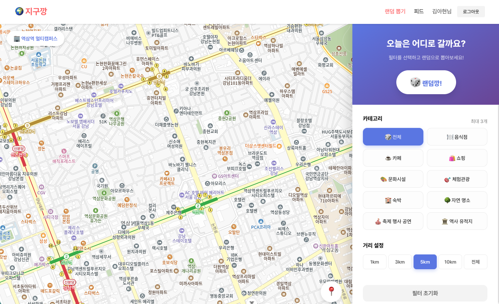</img></p>

### 메인 화면 - 뽑기 결과

<p align="center">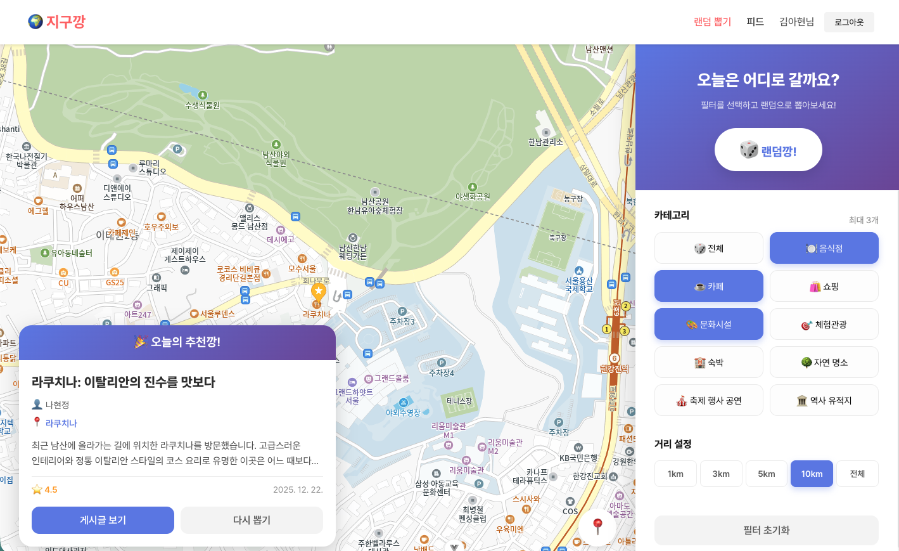</img></p>

### 게시글 상세보기

<p align="center">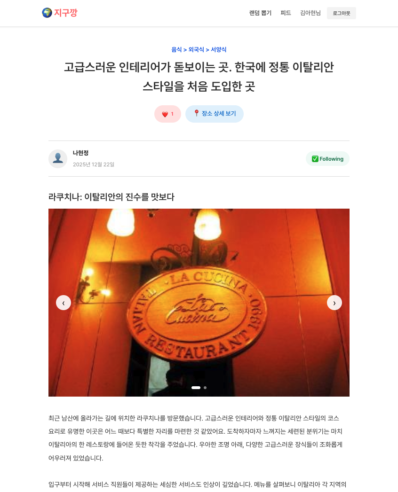</img></p>

### 댓글

<p align="center">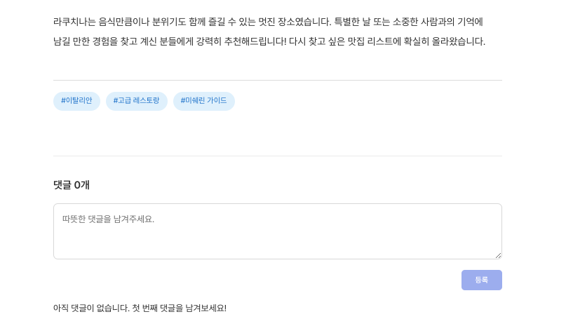</img></p>

### 댓글 제한 설정

<p align="center">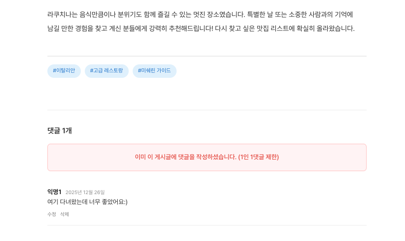</img></p>

### 장소 상세보기

<p align="center">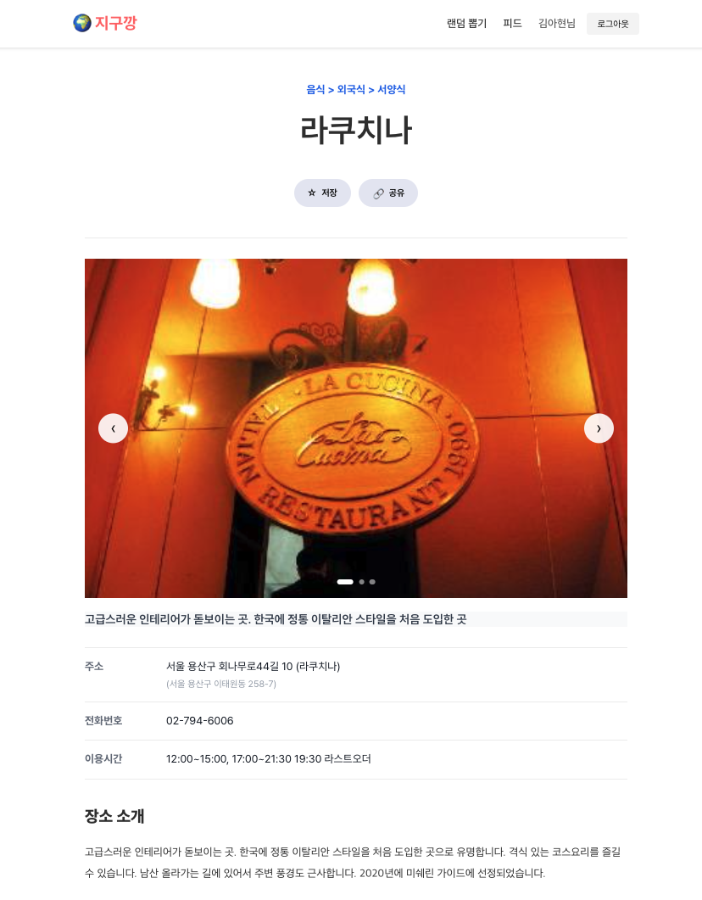</img></p>

### 장소 태그, 장소 정보

<p align="center">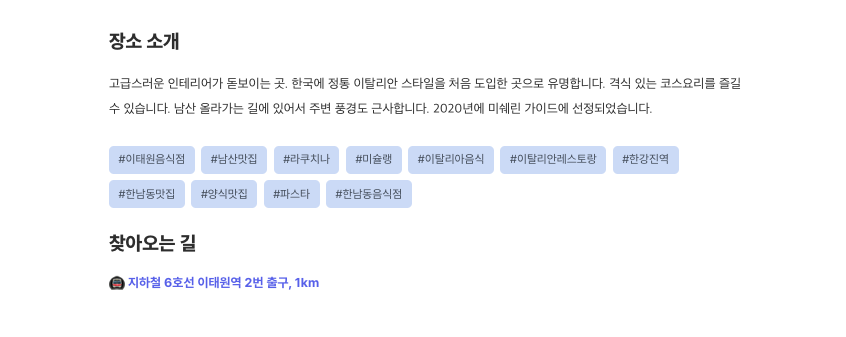</img></p>

### 마이페이지

<p align="center">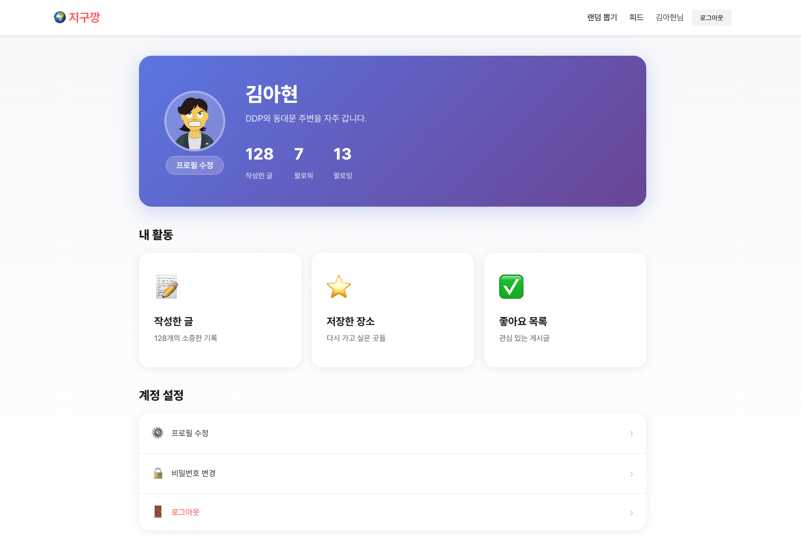</img></p>

### 팔로잉 피드

<p align="center">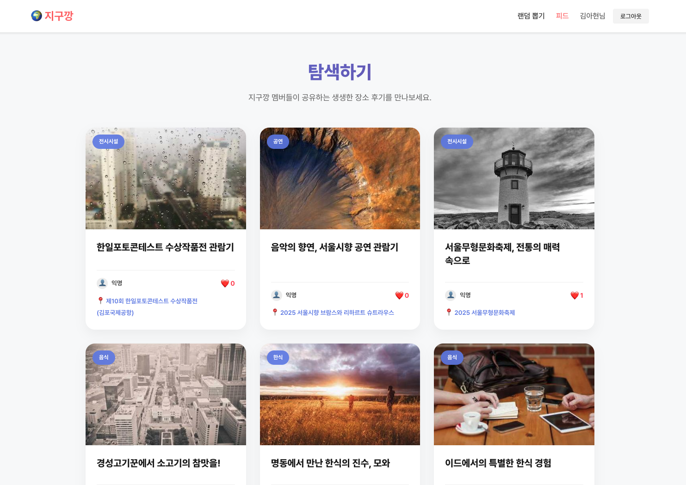</img></p>

### Mattermost 이용 웹훅 설정

<p align="center">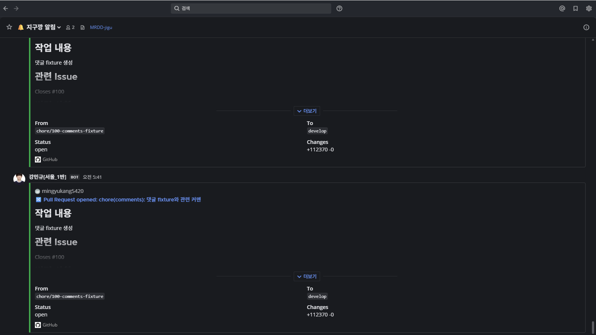</img></p>

### 브랜치 컨벤션과 커밋 컨벤션 준수

<p align="center">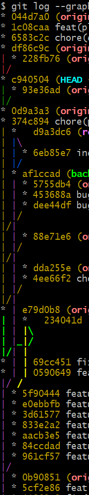</img></p>

---

**프로젝트 기간**: 2025.11.07 ~ 2025.12.26  
**프로젝트 버전**: v1.0  
**Github**: [추후 public 전환 예정](https://github.com/MRDD-jigu/jigukkang/)
33